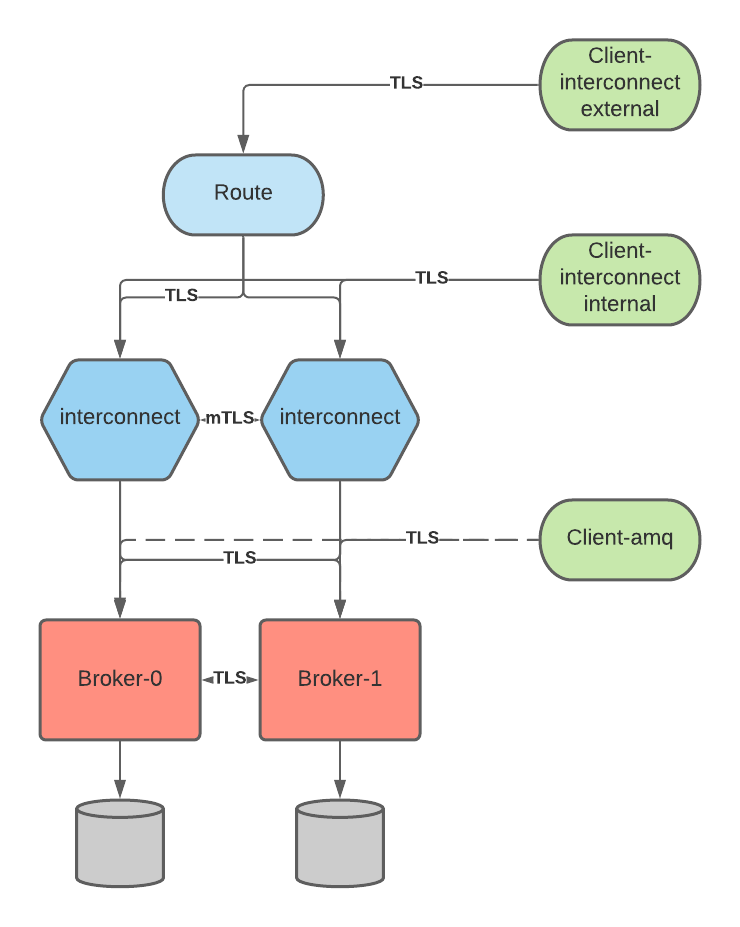

# AMQ

This script will create the following architecture:



All systems are in HA.

All connection are TLS and certificate provisioning and renewal is fully automated.

Three clients options are available.

## Prerequisites

Install a recent version of cert-manager

```shell
oc new-project cert-manager
oc apply --validate=false -f https://github.com/jetstack/cert-manager/releases/download/v1.0.4/cert-manager.yaml
```

## Install AMQ Operator

```shell
export project=amq
oc new-project ${project}
envsubst < ./operator.yaml | oc apply -f - -n ${project}
```

## Helper Operators (optional)

```shell
oc apply -f https://raw.githubusercontent.com/redhat-cop/resource-locker-operator/master/deploy/olm-deploy/subscription.yaml -n ${project}
helm repo add stakater https://stakater.github.io/stakater-charts
helm repo update
export uid=$(oc get project ${project} -o jsonpath='{.metadata.annotations.openshift\.io/sa\.scc\.uid-range}'|sed 's/\/.*//')
helm upgrade -i -n ${project} reloader stakater/reloader --set reloader.deployment.securityContext.runAsUser=${uid}
```

Resource locker operator automates the injection of the injection of keystore and truststore in the secrets.

Reloader automates the reboot of pods when certificates are renewed.

## Install AMQ Broker

### Prepare certificates

```shell
export base_domain=$(oc get dns cluster -o jsonpath='{.spec.baseDomain}')
envsubst < ./certs.yaml | oc apply -f - -n ${project}

# if you installed resource-locker-operator run this
oc adm policy add-role-to-user edit -z default -n ${project}
envsubst < ./cert-patches.yaml | oc apply -f - -n ${project}


# if you didn't install resource-locker-operator run this (and re-run it every time certificates are renewed)
oc extract secret/amq-amqp-tls-secret --keys=keystore.jks --to - -n ${project} > /tmp/broker.ks
oc extract secret/amq-amqp-tls-secret --keys=truststore.jks --to - -n ${project} > /tmp/client.ts
oc set data secret/amq-amqp-tls-secret --from-file=/tmp/broker.ks --from-file=/tmp/client.ts -n ${project}
oc extract secret/amq-console-secret --keys=keystore.jks --to - -n ${project} > /tmp/broker.ks
oc extract secret/amq-console-secret --keys=truststore.jks --to - -n ${project} > /tmp/client.ts
oc set data secret/amq-console-secret --from-file=/tmp/broker.ks --from-file=/tmp/client.ts -n ${project}
```

### Install AMQ Broker

```shell
oc apply -f ./amq.yaml -n ${project}
```

### Certificate renewal

```shell
# if you installed skater/reloader, you have already created the patch configuration above together with the certs

# if you didn't install skater/reloader, run this every time the certificates are renewed
oc rollout restart statefulset amq-ss -n ${project}
```

### Postgresql

```shell
oc process postgresql-ephemeral -n openshift POSTGRESQL_PASSWORD=postgresql POSTGRESQL_USER=postgresql | oc apply -f - -n ${project}
```

## Run a client app

The app can be found here: https://github.com/raffaelespazzoli/amq-test

```shell
oc import-image ubi8/openjdk-11 --from=registry.access.redhat.com/ubi8/openjdk-11 --confirm -n ${project}
oc new-app openjdk-11~https://github.com/raffaelespazzoli/amq-test --name springboot-amq -n ${project} -l app=springboot-amq
oc apply -f ./application-properties.yaml -n ${project}
oc set volume deployment/springboot-amq --add --configmap-name=application-properties --mount-path=/config --name=config -t configmap -n ${project}
oc set volume deployment/springboot-amq --add --secret-name=amq-amqp-tls-secret --mount-path=/certs --name=certs -t secret -n ${project}
oc set env deployment/springboot-amq SPRING_CONFIG_LOCATION=/config/application-properties.yaml SPRING_PROFILES_ACTIVE=server -n ${project}
oc expose service springboot-amq --port 8080-tcp -n ${project}
```

## Install interconnect

Interconnect provides the ability to create broker topology-unaware clients and sets you up for multi-cluster deployment of the brokers.

### Deploy interconnect operator

```shell
oc apply -f ./interconnect-operator.yaml -n ${project}
```

### Deploy certificates

```shell
export base_domain=$(oc get dns cluster -o jsonpath='{.spec.baseDomain}')
envsubst < ./interconnect-certs.yaml | oc apply -f - -n ${project}
```

patching the certs

```shell
# If you installed resource locker operator run the following:
envsubst < ./interconnect-cert-patches.yaml | oc apply -f - -n ${project}

# If you didn't install resource locker, run the following (and every time the certificates are renewed)
oc extract secret/amq-amqp-tls-secret --keys=ca.crt --to - -n ${project} > /tmp/tls.crt
oc set data secret/amq-amqp-mesh-client-tls-secret --from-file=/tmp/tls.crt -n ${project}
```

### Deploy router-mesh

```shell
oc apply -f ./interconnect.yaml -n ${project}
```

### Interconnect certificate renewal

```shell
# if you installed skater/reloader, you have already created the patch configuration above together with the certs

# if you didn't install skater/reloader, run this every time the certificates are renewed
oc rollout restart deployment router-mesh -n ${project}
```

### Run client app internally

```shell
oc new-app openjdk-11~https://github.com/raffaelespazzoli/amq-test --name springboot-interconnect-internal -n ${project} -l app=interconnect-internal-test
export password=$(oc get secret router-mesh-users -n ${project} -o jsonpath='{.data.guest}' | base64 -d)
envsubst < ./interconnect-internal-application-properties.yaml | oc apply -f - -n ${project}
oc set volume deployment/springboot-interconnect-internal --add --configmap-name=interconnect-internal-application-properties --mount-path=/config --name=config -t configmap -n ${project}
oc set volume deployment/springboot-interconnect-internal --add --secret-name=router-mesh-tls --mount-path=/certs --name=certs -t secret -n ${project}
oc set env deployment/springboot-interconnect-internal SPRING_CONFIG_LOCATION=/config/application-properties.yaml -n ${project}
```

### Run client app externally

```shell
oc new-app openjdk-11~https://github.com/raffaelespazzoli/amq-test --name springboot-interconnect-external -n ${project} -l app=interconnect-external-test
export password=$(oc get secret router-mesh-users -n ${project} -o jsonpath='{.data.guest}' | base64 -d)
envsubst < ./interconnect-external-application-properties.yaml | oc apply -f - -n ${project}
oc set volume deployment/springboot-interconnect-external --add --configmap-name=interconnect-external-application-properties --mount-path=/config --name=config -t configmap -n ${project}
oc set volume deployment/springboot-interconnect-external --add --secret-name=router-mesh-tls --mount-path=/certs --name=certs -t secret -n ${project}
oc set env deployment/springboot-interconnect-external SPRING_CONFIG_LOCATION=/config/application-properties.yaml -n ${project}
```